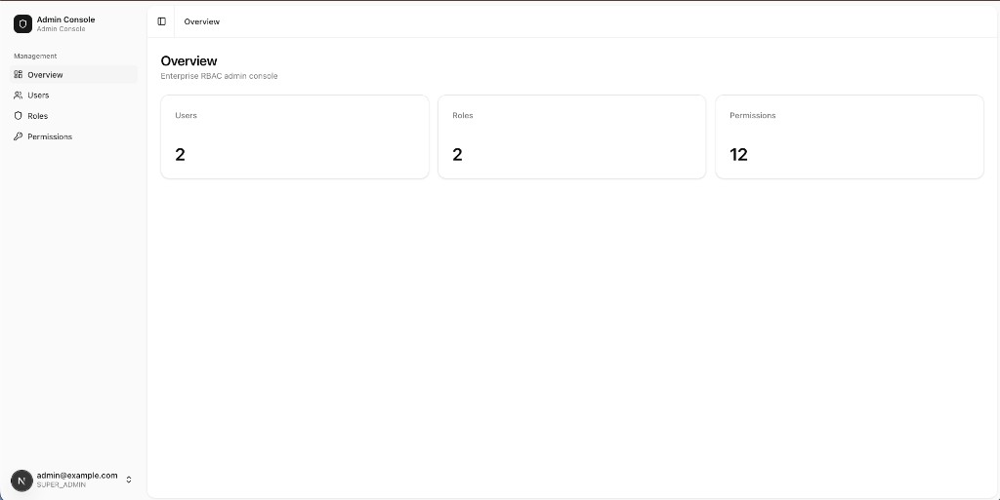

# Multi-brand RE Admin + Marketing (Next.js + FSD)

[](https://github.com/devTugu/nextjs-fsd-portfolio-template/actions/workflows/ci.yml)
[](LICENSE)
[](https://nextjs.org/)

Production-ready **Next.js 16** multi-brand marketing site + admin dashboard with **Feature-Sliced Design**, **httpOnly BFF auth**, and the companion [nestjs-fsd-portfolio-template](https://github.com/devTugu/nestjs-fsd-portfolio-template) v3.0.0 API.



---

## Quick start

### Backend

```bash
git clone https://github.com/devTugu/nestjs-fsd-portfolio-template.git
cd nestjs-fsd-portfolio-template && npm ci && cp .env.example .env
npm run migration:run && npm run seed && npm run start:dev
```

### Frontend

```bash
git clone https://github.com/devTugu/nextjs-fsd-portfolio-template.git
cd nextjs-fsd-portfolio-template && npm ci && cp .env.example .env.local
```

`.env.local`:

```env
API_INTERNAL_URL=http://localhost:3001/api/v1
NEXT_PUBLIC_BRAND_NAME=Your Company Group
```

```bash
npm run dev
```

Open [http://localhost:3000](http://localhost:3000) — **Seed admin:** `admin@example.com` / `Admin123!`

Full setup: [docs/GETTING-STARTED.md](docs/GETTING-STARTED.md) · Full-stack fork: [docs/FORK-GUIDE.md](docs/FORK-GUIDE.md)

---

## Routes (v3)

### Marketing

| Path | Description |
|------|-------------|
| `/` | Hero + About + Brands + News + Contact CTA |
| `/about/us`, `/about/history`, `/about/leadership`, `/about/team` | About pages |
| `/brands`, `/brands/[slug]` | Restaurant/event brands |
| `/news`, `/news/[slug]` | News |
| `/contact` | Contact form |

Legacy redirects: `/blog` → `/news`, `/projects` → `/brands`, `/pricing` → `/contact`

### Admin

| Path | Description |
|------|-------------|
| `/sign-in` | Login (BFF httpOnly cookies) |
| `/dashboard` | Overview stats |
| `/dashboard/brands` | Brands, menu items, events |
| `/dashboard/history` | Company timeline |
| `/dashboard/leadership`, `/dashboard/team` | People |
| `/dashboard/news` | News CRUD |
| `/dashboard/navigation` | Header/footer nav tree |
| `/dashboard/site-settings` | Hero, about, brandColor, SEO |
| `/dashboard/users`, `/roles`, `/permissions` | RBAC |
| `/dashboard/audit-logs`, `/dashboard/security` | Audit + MFA |

---

## Tech stack

| Category | Technology |
|----------|------------|
| Framework | Next.js 16 (App Router) |
| Auth | BFF + httpOnly cookies + CSRF |
| Data | TanStack Query v5 |
| Forms | react-hook-form + Zod |
| UI | shadcn/ui + Tailwind CSS 4 |
| Tests | Vitest + Playwright |

---

## Documentation

Start at **[docs/README.md](docs/README.md)**

| Guide | Description |
|-------|-------------|
| [Architecture](docs/ARCHITECTURE.md) | FSD + BFF pattern |
| [Site Guide](docs/SITE-GUIDE.md) | Marketing routes |
| [Admin Guide](docs/ADMIN-GUIDE.md) | Dashboard CRUD |
| [Security](docs/SECURITY.md) | BFF, CSRF, cookies |
| [Deployment](docs/DEPLOYMENT.md) | Production deploy |
| [White Label](docs/WHITE-LABEL.md) | Brand configuration |
| [Fork Guide](docs/FORK-GUIDE.md) | Full-stack fork |
| [ADR](docs/adr/) | Architecture decisions |

---

## Pairing

| Frontend | Backend |
|----------|---------|
| [nextjs-fsd-portfolio-template](https://github.com/devTugu/nextjs-fsd-portfolio-template) | [nestjs-fsd-portfolio-template](https://github.com/devTugu/nestjs-fsd-portfolio-template) |
| Port `3000` | Port `3001` |
| **v3.0.0** | **v3.0.0** |

---

## Scripts

| Command | Description |
|---------|-------------|
| `npm run dev` | Development server |
| `npm run build` | Production build |
| `npm run typecheck` | TypeScript |
| `npm run test` | Vitest |
| `npm run test:e2e` | Playwright |
| `bash scripts/fork-check.sh` | Smoke check |

---

## License

[MIT](LICENSE)
