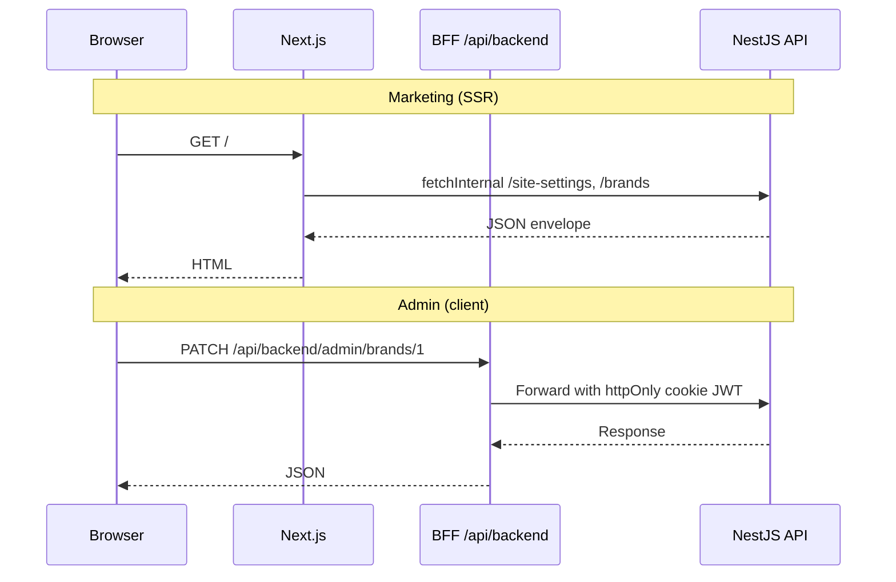

# Architecture

Next.js 16 app using **Feature-Sliced Design (FSD)** with a **Backend-for-Frontend (BFF)** auth layer.

## Layer structure

```
app/           # Next.js App Router (routes, layouts, API routes)
widgets/       # Composed UI blocks (sidebar, marketing sections)
features/      # User interactions (auth, brands CRUD, MFA)
entities/      # Business models + API clients
shared/        # Config, UI kit, i18n, utilities
processes/     # App-wide providers, proxy handler
```

**Import rule:** upper layers import from lower layers only (`app` → `widgets` → `features` → `entities` → `shared`).

## Request flow



## BFF pattern

- Browser never holds access tokens in `localStorage`
- Auth cookies set by `/api/auth/*` route handlers
- Admin API calls go through `/api/backend/*` with allowlist (`bff-allowlist.ts`)
- Server components call Nest API directly via `API_INTERNAL_URL`

## Key modules

| Area | Location |
|------|----------|
| Marketing pages | `app/(marketing)/` |
| Admin dashboard | `app/dashboard/` |
| Auth routes | `app/api/auth/` |
| Public API client | `src/entities/public-api/public-server.ts` |
| Proxy redirects | `src/processes/proxy.ts` |
| Route constants | `src/shared/config/routes.ts` |

## Related

- [Security](SECURITY.md)
- [ADR 001](adr/001-feature-sliced-design.md)
- [ADR 002](adr/002-bff-httponly-auth.md)
