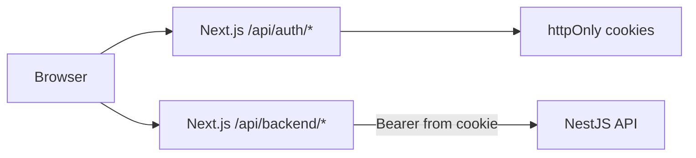

# Security

## Authentication (BFF + httpOnly cookies)

- **Access / refresh tokens**: Stored in `httpOnly` cookies set by Next.js BFF routes (`/api/auth/*`). Not accessible to client JavaScript.
- **Session hint**: Non-httpOnly `session=1` cookie + `sessionStorage` expiry used by middleware and proactive refresh scheduling.
- **Browser API calls**: Same-origin `/api/backend/*` proxy attaches `Authorization: Bearer` from the access cookie server-side.
- **Logout**: `POST /api/auth/logout` clears cookies and calls Nest logout when refresh token is present.

See [ADR 006: BFF httpOnly Cookie Authentication](./adr/006-bff-httponly-auth.md).

## Token refresh

- Axios interceptor refreshes via `POST /api/auth/refresh` on `401` (single retry).
- `TokenRefreshScheduler` proactively refreshes before expiry.
- `SessionExpiryDialog` warns users ~2 minutes before session end.
- Failed refresh → redirect to `/sign-in`.

## Authorization (RBAC)

- `GET /api/auth/me` returns `roles[]` and `permissionCodes[]`.
- UI gates actions with `useAuthPermissions().can(PERMISSION_CODES.*)`.
- `SUPER_ADMIN` bypasses UI checks; API always enforces permissions.

Never rely on UI gating alone.

## Route protection

[`middleware.ts`](../middleware.ts) checks the `session` cookie on `/dashboard/*` and redirects to `/sign-in`.

`AuthGuard` hydrates from `/api/auth/me` after client mount.

## HTTP client

- Browser base URL: `/api/backend` (BFF proxy).
- Server-only `API_INTERNAL_URL` for BFF → Nest (never expose to client).
- Nest envelope unwrapped in `shared/api/client.ts`.
- `403` responses show permission context in toast when available.

## Secrets

- Never commit `.env.local`.
- JWT secrets live on the Nest API only.
- Only `NEXT_PUBLIC_*` vars are browser-visible (`NEXT_PUBLIC_APP_NAME`).

## Headers

[`next.config.ts`](../next.config.ts):

- **Development:** CSP is not sent (Next.js dev/Turbopack requires inline scripts).
- **Production:** `default-src 'self'`, `script-src 'self' 'unsafe-inline'`, `connect-src 'self'`, plus `font-src` / `img-src` for UI assets.
- `X-Frame-Options: DENY`
- `X-Content-Type-Options: nosniff`
- `Referrer-Policy: strict-origin-when-cross-origin`

## Production checklist

- [ ] HTTPS everywhere
- [ ] `API_INTERNAL_URL` points to private/reachable Nest URL from Next server
- [ ] Nest `CORS_ORIGIN` locked to Next origin (for Swagger/direct API only)
- [ ] `SWAGGER_ENABLED=false` on API
- [ ] Strong JWT secrets (32+ chars)
- [ ] `npm audit` on both repos
- [ ] Review RBAC seeds before production

## Reporting issues

Open a private security advisory on GitHub or contact the maintainer listed in the repository.
